# gwt-register-spec

Sub-skill called from `gwt-discussion` to materialize an already-decided SPEC
design into a `gwt-spec` GitHub Issue. Encapsulates the canonical 2-step
`gwtd issue spec create` → `gwtd issue spec --edit spec` flow so that the
section-marker trap (an empty spec section because `create -f` does not wrap
the body in `<!-- artifact:spec BEGIN/END -->` markers) cannot happen.

## gwtd resolution

Before executing any `gwtd ...` command from this skill or its references,
resolve `GWT_BIN` first: executable `GWT_BIN_PATH`, then `command -v gwtd`,
then `$GWT_PROJECT_ROOT/target/debug/gwtd` or `./target/debug/gwtd`. Run the
command as `"$GWT_BIN" ...`; if none exists, stop with an actionable
`gwtd not found` error.

## When to use

- `gwt-discussion` has reached Phase 5 and its Action Bundle includes
  `Register Spec`.
- The caller already has the SPEC title (`SPEC: <title>`) and a complete
  SPEC body file on disk with the 7 canonical sections filled in.
- A new SPEC owner is needed; an existing SPEC owner has already been ruled
  out by duplicate search in `gwt-discussion` / `gwt-register-issue`.

Do not use this when the design is still under discussion (use
`gwt-discussion`), when the request is narrow enough for a plain Issue (use
`gwt-register-issue`), or when an existing SPEC needs additional sections
(use `gwt-discussion` followed by `gwtd issue spec <n> --edit <section>` —
this skill does not edit existing SPECs).

## Ownership

- Validate the provided body against the canonical SPEC contract.
- Create the GitHub Issue safely (no orphan Issue on validation failure).
- Inject the spec section via `--edit spec -f <body>` so the section markers
  are auto-applied.
- Roundtrip-verify by reading `--section spec` back and asserting non-empty.
- Hand off the new Issue number to the caller. Plan / tasks sections are the
  responsibility of `gwt-plan-spec` and are out of scope.

## Inputs

The skill takes two inputs from the caller:

1. `title` — string. Must match `^SPEC: .+$`. Becomes the GitHub Issue title.
2. `body_path` — filesystem path. Must point to a UTF-8 markdown file with
   the canonical 7 sections (see `references/body-template.md`). The H1 inside
   the file must equal `title`.

The caller is responsible for assembling `body_path` from discussion
artifacts (`.gwt/discussion.md`, Action Delta, plan file). This skill never
generates content; it only validates and materializes.

## Workflow

Run these steps in order. If any step fails with `validation` or `roundtrip`
severity, stop immediately and report back. Do not retry silently.

```dot
digraph register_spec_flow {
    "start lifecycle" -> "load body";
    "load body" -> "validate (structural + format-quality)";
    "validate" -> "report issues" [label="any Structural issue"];
    "validate" -> "gwtd issue spec create --title <t> -f <stub>" [label="all PASS"];
    "create" -> "abort: io failure" [label="error"];
    "create" -> "gwtd issue spec <n> --edit spec -f <body>" [label="issue created"];
    "edit" -> "recovery report (orphan Issue #N)" [label="edit failure"];
    "edit" -> "gwtd issue spec <n> --section spec" [label="edit ok"];
    "section spec" -> "abort: empty spec" [label="empty"];
    "section spec" -> "complete lifecycle, return Issue #N + URL" [label="non-empty"];
}
```

1. **Lifecycle start**: `gwtd register start --spec 0` (placeholder spec id;
   the real id is recorded via `phase` once the Issue is created).
2. **Load body**: read `body_path` as UTF-8.
3. **Validate**: call the validation library (see
   `references/validation-rules.md`). On any `Structural` or `Format` issue,
   call `gwtd register abort --spec 0 --reason "validation: 
"` and
   return the issue list to the caller. Do not call any GitHub API.
4. **Create shell**: `gwtd issue spec create --title "<title>" -f <stub>`
   where `<stub>` is an empty placeholder file. Capture the new issue
   number.
5. **Phase create**: `gwtd register phase --spec <n> --label create` to bind
   the real spec id and record the milestone.
6. **Inject body**: `gwtd issue spec <n> --edit spec -f <body_path>`. The
   `--edit` command auto-applies `<!-- artifact:spec BEGIN/END -->` markers.
7. **Phase edit**: `gwtd register phase --spec <n> --label edit`.
8. **Roundtrip verify**: `gwtd issue spec <n> --section spec`. The output
   must be non-empty and must contain the H1 line of the body file. On
   failure, follow `references/recovery.md` and abort.
9. **Phase roundtrip**: `gwtd register phase --spec <n> --label roundtrip`.
10. **Complete**: `gwtd register complete --spec <n>`. Return `{ issue: <n>,
    url: "https://github.com/akiojin/gwt/issues/<n>" }` to the caller.

## Validation rules

See `references/validation-rules.md` for the canonical list. Summary:

| Severity | Rule |
|---|---|
| Structural | Title matches `^SPEC: .+$` |
| Structural | H1 in body equals title |
| Structural | All 7 required sections exist (`背景`, `ユビキタス言語`, `ユーザーシナリオと受け入れシナリオ`, `機能要件`, `成功基準`, `Out of Scope`, `Related Artifacts`) |
| Structural | `機能要件` contains at least one `FR-NNN` line |
| Structural | No `[NEEDS CLARIFICATION]` markers anywhere |
| Format | FR identifiers are contiguous (`FR-001`, `FR-002`, … no gaps) |

Structural issues block create. Format issues also block create in v1
(hard-fail policy).

## Failure policy

- **Validation failure** → no Issue created. Report each
  `ValidationIssue { severity, location, message }` to the caller.
- **Create failure** (network, auth) → no Issue created. Surface the gh / gwtd
  error verbatim and `register abort`.
- **Edit failure after create success** → the Issue exists but is empty.
  Follow `references/recovery.md` to either retry `--edit spec` or open the
  Issue for manual repair. Always include the orphan Issue number in the
  recovery report.
- **Roundtrip empty** → the `--edit` call apparently succeeded but the
  section is unreadable. Treat as `Edit failure after create success`.

## Recovery

See `references/recovery.md`. The skill never silently retries; the caller
(and any human reviewer) must see the orphan Issue and act.

## Exit CLI (Stop-block contract)

The skill registers lifecycle events through `gwtd register`:

- `gwtd register start --spec 0` at the beginning (placeholder spec id).
- `gwtd register phase --spec <n> --label <validation|create|edit|roundtrip>`
  at each milestone.
- `gwtd register complete --spec <n>` once the Issue is created and verified.
- `gwtd register abort --spec <n|0> --reason '<text>'` on any failure.

State file: `<worktree>/.gwt/skill-state/register-spec.json`. The
`skill-register-spec-stop-check` Stop hook returns
`{"decision":"block","reason":"..."}` while the state is active, honoring the
shared `stop_hook_active` fail-safe so each Stop cycle allows at most one
forced continuation.

## Chain suggestion

On `register complete`, suggest `gwt-plan-spec --spec <n>` as the next step.
