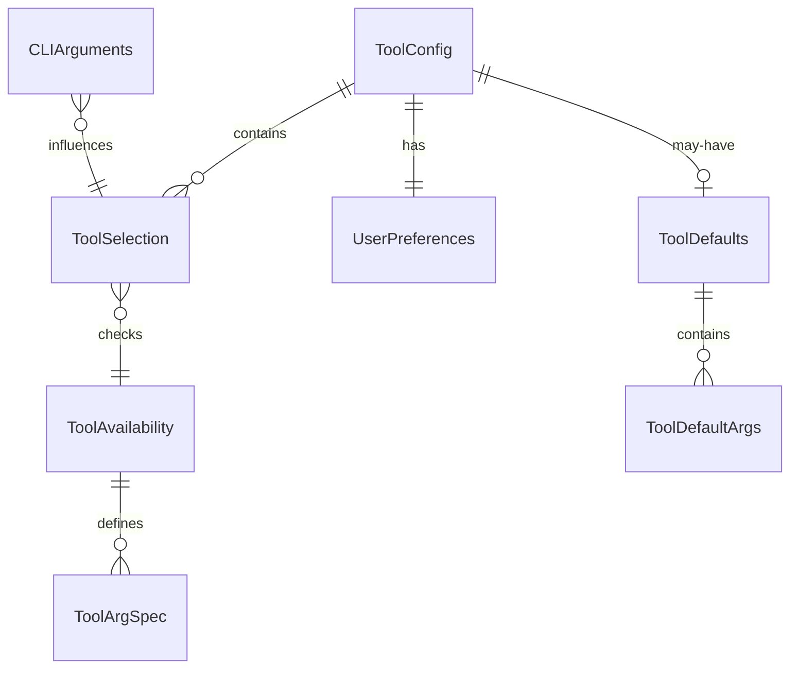

# データモデル: Codex CLI対応

**機能**: worktree起動時のツール選択  
**日付**: 2025-01-06  
**バージョン**: 1.0.0

## エンティティ定義

### 1. ToolSelection
**説明**: ユーザーが選択したAIツールと選択時の情報

| フィールド | 型 | 必須 | 説明 | バリデーション |
|-----------|-----|------|------|---------------|
| tool | string | ✓ | 選択されたツール識別子 | 'claude' \| 'codex' |
| timestamp | Date | ✓ | 選択日時 | ISO 8601形式 |
| source | string | ✓ | 選択方法 | 'interactive' \| 'cli-option' \| 'default' |
| sessionId | string | ✓ | セッション識別子 | UUID v4 |
| toolArgs | string[] | ✗ | ツール固有の引数 | 各ツールの仕様に準拠 |

**状態遷移**:
```
[未選択] → [選択中] → [選択完了] → [起動済み]
         ↓
      [キャンセル]
```

### 2. ToolConfig
**説明**: ツール選択に関する設定と履歴

| フィールド | 型 | 必須 | 説明 | バリデーション |
|-----------|-----|------|------|---------------|
| version | string | ✓ | 設定ファイルバージョン | semver形式 |
| defaultTool | string | ✗ | デフォルトツール | 'claude' \| 'codex' \| null |
| lastSelection | string | ✗ | 最後の選択 | 'claude' \| 'codex' \| null |
| selectionHistory | ToolSelection[] | ✓ | 選択履歴 | 最大100件保持 |
| preferences | UserPreferences | ✓ | ユーザー設定 | - |
| toolDefaults | ToolDefaults | ✗ | ツール固有のデフォルト引数 | - |

### 3. UserPreferences
**説明**: ユーザーの動作設定

| フィールド | 型 | 必須 | デフォルト | 説明 |
|-----------|-----|------|------------|------|
| rememberSelection | boolean | ✓ | true | 選択を記憶するか |
| showWelcomeMessage | boolean | ✓ | true | 起動時メッセージ表示 |
| autoSelectTimeout | number | ✗ | null | 自動選択タイムアウト（ms） |
| colorOutput | boolean | ✓ | true | カラー出力を使用 |
| passThroughArgs | boolean | ✓ | true | -- 以降の引数を透過的に渡す |

### 4. ToolAvailability
**説明**: ツールの利用可能性情報

| フィールド | 型 | 必須 | 説明 |
|-----------|-----|------|------|
| tool | string | ✓ | ツール識別子 |
| available | boolean | ✓ | 利用可能かどうか |
| path | string | ✗ | 実行ファイルパス |
| version | string | ✗ | インストール済みバージョン |
| checkedAt | Date | ✓ | 確認日時 |
| error | string | ✗ | エラーメッセージ |
| supportedArgs | ToolArgSpec[] | ✗ | サポートされる引数仕様 |

### 5. CLIArguments
**説明**: コマンドライン引数の解析結果

| フィールド | 型 | 必須 | 説明 |
|-----------|-----|------|------|
| tool | string | ✗ | 直接指定されたツール |
| resetDefault | boolean | ✗ | デフォルト設定リセット |
| help | boolean | ✗ | ヘルプ表示 |
| version | boolean | ✗ | バージョン表示 |
| noColor | boolean | ✗ | カラー出力無効化 |
| quiet | boolean | ✗ | 静音モード |
| passThrough | string[] | ✗ | -- 以降の引数（ツールに渡す） |

### 6. ToolDefaults
**説明**: ツール固有のデフォルト引数設定

| フィールド | 型 | 必須 | 説明 |
|-----------|-----|------|------|
| claude | ToolDefaultArgs | ✗ | Claude Code用デフォルト引数 |
| codex | ToolDefaultArgs | ✗ | Codex CLI用デフォルト引数 |

### 7. ToolDefaultArgs
**説明**: 各ツールのデフォルト引数

| フィールド | 型 | 必須 | 説明 |
|-----------|-----|------|------|
| args | string[] | ✓ | デフォルト引数リスト |
| override | boolean | ✓ | ユーザー指定時に上書きするか |

### 8. ToolArgSpec
**説明**: ツールがサポートする引数の仕様

| フィールド | 型 | 必須 | 説明 | 例 |
|-----------|-----|------|------|-----|
| name | string | ✓ | 引数名 | '-r', '--continue' |
| description | string | ✓ | 引数の説明 | 'Resume previous session' |
| type | string | ✓ | 引数の型 | 'flag' \| 'value' |
| conflicts | string[] | ✗ | 競合する引数 | ['-c'] |

## ツール固有の引数マッピング

### Claude Code引数
```typescript
const claudeArgs: ToolArgSpec[] = [
  {
    name: '-r',
    description: 'Resume previous session',
    type: 'flag',
    conflicts: ['-c']
  },
  {
    name: '-c',
    description: 'Continue with context',
    type: 'flag',
    conflicts: ['-r']
  }
];
```

### Codex CLI引数
```typescript
const codexArgs: ToolArgSpec[] = [
  {
    name: '--continue',
    description: 'Continue current session',
    type: 'flag',
    conflicts: ['--resume']
  },
  {
    name: '--resume',
    description: 'Resume from previous state',
    type: 'flag',
    conflicts: ['--continue']
  }
];
```

## リレーションシップ



## データ永続化

### ファイルパス
- 設定ファイル: `~/.worktree/config.json`
- ログファイル: `~/.worktree/logs/selection.log`
- キャッシュ: `~/.worktree/cache/tool-availability.json`

### スキーマバージョン管理
- 現在のバージョン: 1.0.0
- 後方互換性: マイナーバージョンまで保証
- マイグレーション: メジャーバージョン変更時に実行

## バリデーションルール

### ToolSelection
1. toolは定義済みの値のみ許可
2. timestampは現在時刻を超えない
3. sessionIdは有効なUUID v4
4. toolArgsは各ツールの仕様に準拠

### ToolConfig
1. versionは有効なsemver
2. selectionHistoryは時系列順
3. 履歴は最大100件、古いものから削除
4. toolDefaultsの引数は各ツールの仕様に準拠

### CLIArguments
1. passThroughは -- の後の引数のみ
2. toolが指定された場合は有効な値のみ
3. 競合するオプションの同時指定は禁止

### ToolAvailability
1. pathは絶対パス
2. checkedAtは過去24時間以内
3. availableがfalseの場合はerrorが必須
4. supportedArgsは各ツールの公式仕様と一致

## データアクセスパターン

### 読み取り
1. 設定ファイル読み込み（起動時1回）
2. ツール利用可能性チェック（キャッシュ優先）
3. 履歴の最新N件取得
4. ツール固有引数仕様の取得

### 書き込み
1. 選択結果の保存（選択完了時）
2. 設定の更新（ユーザー操作時）
3. キャッシュの更新（24時間ごと）
4. 引数履歴の追加

### トランザクション
- ファイル書き込みはアトミック操作
- 一時ファイル作成 → リネームパターン
- ロックファイルで同時実行を防止

## セキュリティ考慮事項

1. **ファイル権限**: 600（所有者のみ読み書き）
2. **パス検証**: ディレクトリトラバーサル防止
3. **入力サニタイズ**: コマンドインジェクション防止
4. **ログ**: 機密情報を含めない
5. **引数検証**: ツール固有引数の妥当性確認

## パフォーマンス最適化

1. **キャッシュ戦略**:
   - ツール利用可能性: 24時間
   - 設定ファイル: プロセス終了まで
   - 引数仕様: 初回取得後メモリ保持

2. **インデックス**:
   - 履歴: timestamp降順

3. **圧縮**:
   - 履歴が50件を超えたら古いデータを圧縮

---
*機能仕様 FR-001〜FR-010 に対応*