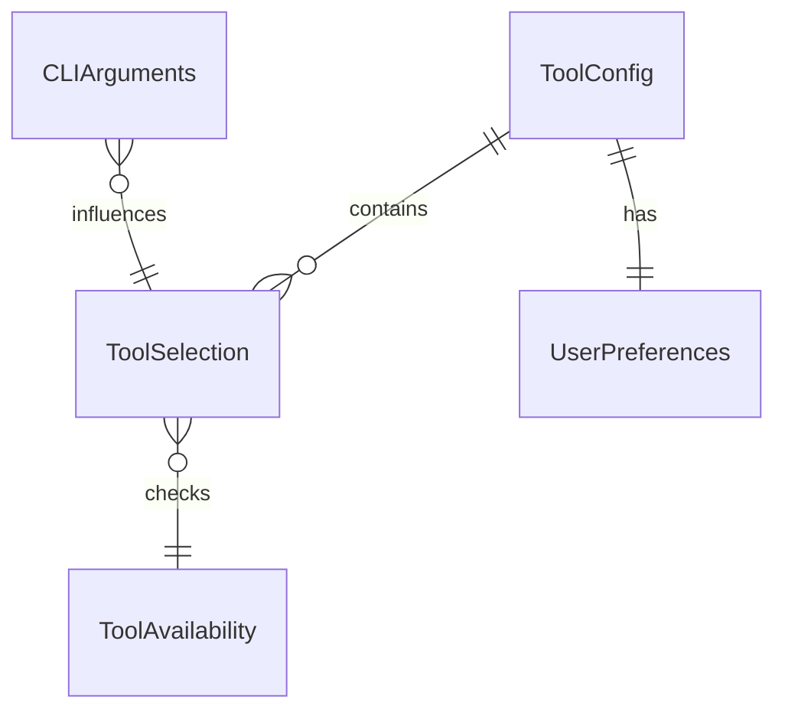

# データモデル: Codex CLI対応

**機能**: worktree起動時のツール選択  
**日付**: 2025-01-06  
**バージョン**: 1.0.0

## エンティティ定義

### 1. ToolSelection
**説明**: ユーザーが選択したAIツールと選択時の情報

| フィールド | 型 | 必須 | 説明 | バリデーション |
|-----------|-----|------|------|---------------|
| tool | string | ✓ | 選択されたツール識別子 | 'claude' \| 'codex' |
| timestamp | Date | ✓ | 選択日時 | ISO 8601形式 |
| source | string | ✓ | 選択方法 | 'interactive' \| 'cli-option' \| 'default' |
| sessionId | string | ✓ | セッション識別子 | UUID v4 |

**状態遷移**:
```
[未選択] → [選択中] → [選択完了] → [起動済み]
         ↓
      [キャンセル]
```

### 2. ToolConfig
**説明**: ツール選択に関する設定と履歴

| フィールド | 型 | 必須 | 説明 | バリデーション |
|-----------|-----|------|------|---------------|
| version | string | ✓ | 設定ファイルバージョン | semver形式 |
| defaultTool | string | ✗ | デフォルトツール | 'claude' \| 'codex' \| null |
| lastSelection | string | ✗ | 最後の選択 | 'claude' \| 'codex' \| null |
| selectionHistory | ToolSelection[] | ✓ | 選択履歴 | 最大100件保持 |
| preferences | UserPreferences | ✓ | ユーザー設定 | - |

### 3. UserPreferences
**説明**: ユーザーの動作設定

| フィールド | 型 | 必須 | デフォルト | 説明 |
|-----------|-----|------|------------|------|
| rememberSelection | boolean | ✓ | true | 選択を記憶するか |
| showWelcomeMessage | boolean | ✓ | true | 起動時メッセージ表示 |
| autoSelectTimeout | number | ✗ | null | 自動選択タイムアウト（ms） |
| colorOutput | boolean | ✓ | true | カラー出力を使用 |

### 4. ToolAvailability
**説明**: ツールの利用可能性情報

| フィールド | 型 | 必須 | 説明 |
|-----------|-----|------|------|
| tool | string | ✓ | ツール識別子 |
| available | boolean | ✓ | 利用可能かどうか |
| path | string | ✗ | 実行ファイルパス |
| version | string | ✗ | インストール済みバージョン |
| checkedAt | Date | ✓ | 確認日時 |
| error | string | ✗ | エラーメッセージ |

### 5. CLIArguments
**説明**: コマンドライン引数の解析結果

| フィールド | 型 | 必須 | 説明 |
|-----------|-----|------|------|
| tool | string | ✗ | 直接指定されたツール |
| resetDefault | boolean | ✗ | デフォルト設定リセット |
| help | boolean | ✗ | ヘルプ表示 |
| version | boolean | ✗ | バージョン表示 |
| noColor | boolean | ✗ | カラー出力無効化 |
| quiet | boolean | ✗ | 静音モード |

## リレーションシップ



## データ永続化

### ファイルパス
- 設定ファイル: `~/.worktree/config.json`
- ログファイル: `~/.worktree/logs/selection.log`
- キャッシュ: `~/.worktree/cache/tool-availability.json`

### スキーマバージョン管理
- 現在のバージョン: 1.0.0
- 後方互換性: マイナーバージョンまで保証
- マイグレーション: メジャーバージョン変更時に実行

## バリデーションルール

### ToolSelection
1. toolは定義済みの値のみ許可
2. timestampは現在時刻を超えない
3. sessionIdは有効なUUID v4

### ToolConfig
1. versionは有効なsemver
2. selectionHistoryは時系列順
3. 履歴は最大100件、古いものから削除

### UserPreferences
1. autoSelectTimeoutは0以上の整数またはnull
2. 設定値は型が一致すること

### ToolAvailability
1. pathは絶対パス
2. checkedAtは過去24時間以内
3. availableがfalseの場合はerrorが必須

## データアクセスパターン

### 読み取り
1. 設定ファイル読み込み（起動時1回）
2. ツール利用可能性チェック（キャッシュ優先）
3. 履歴の最新N件取得

### 書き込み
1. 選択結果の保存（選択完了時）
2. 設定の更新（ユーザー操作時）
3. キャッシュの更新（24時間ごと）

### トランザクション
- ファイル書き込みはアトミック操作
- 一時ファイル作成 → リネームパターン
- ロックファイルで同時実行を防止

## セキュリティ考慮事項

1. **ファイル権限**: 600（所有者のみ読み書き）
2. **パス検証**: ディレクトリトラバーサル防止
3. **入力サニタイズ**: コマンドインジェクション防止
4. **ログ**: 機密情報を含めない

## パフォーマンス最適化

1. **キャッシュ戦略**:
   - ツール利用可能性: 24時間
   - 設定ファイル: プロセス終了まで

2. **インデックス**:
   - 履歴: timestamp降順

3. **圧縮**:
   - 履歴が50件を超えたら古いデータを圧縮

---
*機能仕様 FR-001〜FR-010 に対応*