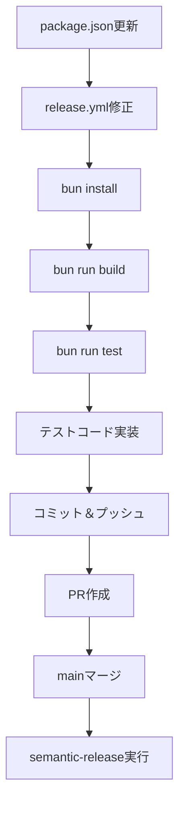

# 実装計画: develop-to-main手動リリースフローとsemantic-release統合

**仕様ID**: `SPEC-23bb2eed` | **日付**: 2025-01-06（更新） | **仕様書**: [spec.md](./spec.md)
**入力**: `/specs/SPEC-23bb2eed/spec.md` からの機能仕様

## 概要

developブランチを導入し、feature→develop(Auto Merge)→/releaseコマンド→develop→mainマージ→semantic-release自動実行というワークフローを実装します。これにより、任意のタイミングでリリースを実行可能にします。

**主要な目標**:
- developブランチの作成とfeature→develop Auto Mergeの設定
- /releaseコマンドによる手動リリーストリガーの実装
- develop→mainマージ時のsemantic-release自動実行
- コミットメッセージベースの自動バージョン決定
- CHANGELOG.mdとpackage.jsonの自動更新
- npm registryとGitHub Releasesへの自動公開

## 技術コンテキスト

**言語/バージョン**: TypeScript 5.8.3, Bun 1.0.0+
**主要な依存関係**:

- semantic-release 24.2.0（自動リリースツール本体）
- @semantic-release/commit-analyzer 13.0.0（コミット分析）
- @semantic-release/release-notes-generator 14.0.1（リリースノート生成）
- @semantic-release/changelog 6.0.3（CHANGELOG生成）
- @semantic-release/npm 12.0.1（npm公開）
- @semantic-release/git 10.0.1（Git操作）
- @semantic-release/github 11.0.1（GitHub Releases作成）

**テスト**: Vitest 2.1.8（既存のテストスイート）
**ターゲットプラットフォーム**: GitHub Actions（ubuntu-latest）
**プロジェクトタイプ**: CLI ツール（単一プロジェクト）

**制約**:
- Conventional Commits形式のコミットメッセージが必要
- SEMANTIC_RELEASE_TOKENとNPM_TOKENがGitHub Secretsに設定されていること
- mainとdevelopブランチへのプッシュ時にCIワークフロー（test、lint）が実行されること
- Claude Codeでgh CLIが利用可能であること

## 原則チェック

### CLAUDE.md との整合性チェック

#### 1. シンプルさの原則

**原則**: "設計・実装は複雑にせずに、シンプルさの極限を追求してください"

**評価**:
- ✅ semantic-releaseの既存設定を活用
- ✅ developブランチ作成のみで既存機能は維持
- ✅ 既存のAuto Mergeワークフローを再利用
- ✅ /releaseコマンドはgh workflow runの薄いラッパー

**結論**: 原則に整合

#### 2. ユーザビリティと開発者体験

**原則**: "ただし、ユーザビリティと開発者体験の品質は決して妥協しない"

**評価**:
- ✅ /releaseコマンド1つでリリース実行（直感的）
- ✅ developブランチで変更を蓄積可能（柔軟なリリースタイミング）
- ✅ Auto Mergeでfeature→develop統合自動化
- ✅ 自動CHANGELOG生成（ドキュメント作成の手間削減）
- ✅ セマンティックバージョニングの自動適用（ミス防止）

**結論**: 原則に整合

#### 3. 完了条件

**原則**: "エラーが発生している状態で完了としないこと"

**評価**:
- ✅ 依存関係のインストール確認
- ✅ ビルドとテストの成功確認
- ✅ ワークフローの動作確認

**結論**: 原則に準拠

## プロジェクト構造

### ドキュメント（この機能）

```text
specs/SPEC-23bb2eed/
├── spec.md                # 機能仕様 ✅
├── plan.md                # このファイル ✅
├── tasks.md               # Phase 2 出力 ⏭️
├── checklists/
│   └── requirements.md    # 仕様品質チェックリスト
├── data-model.md          # Phase 1 出力 ⏭️
├── quickstart.md          # Phase 1 出力 ⏭️
└── research.md            # Phase 0 調査結果
```

### ソースコード（リポジトリルート）

```text
.github/workflows/
├── release.yml            # 変更済み: workflow_runトリガーを削除、mainプッシュのみ
├── release-trigger.yml    # 新規: develop→mainマージワークフロー
├── auto-merge.yml         # 既存: 全ブランチ対象（変更不要）
├── test.yml               # 既存: develop対応済み（変更不要）
└── lint.yml               # 既存: develop対応済み（変更不要）

.claude/commands/
└── release.md             # 新規: /releaseスラッシュコマンド

package.json               # 既存: semantic-release依存済み（変更不要）
.releaserc.json            # 既存: 設定は適切（変更不要）
README.md                  # 変更済み: リリースフロー説明を更新
README.ja.md               # 変更済み: リリースフロー説明を追加
CLAUDE.md                  # 変更済み: リリースワークフロー説明を追加
```

## フェーズ0: 調査（技術スタック選定）

**状態**: ✅ 完了

### 調査結果

1. **既存の設定確認**
   - ✅ `.releaserc.json`が存在し、適切に設定されている
   - ✅ `release.yml`がmainブランチトリガーで設定されている
   - ❌ semantic-release関連パッケージが未インストール

2. **問題点の特定**
   - semantic-release本体と6つのプラグインが`devDependencies`に含まれていない
   - `release.yml`に冗長な`publish-npm`ジョブが存在（semantic-releaseと二重公開）

3. **技術的決定**
   - **決定1**: 必要なsemantic-releaseパッケージをインストール
   - **決定2**: `release.yml`から`publish-npm`ジョブを削除
   - **決定3**: `.releaserc.json`の設定は現状維持（適切なため）

## フェーズ1: 設計（アーキテクチャと契約）

**状態**: ✅ 完了（設計は最小限）

### アーキテクチャ概要


### 主要コンポーネント

1. **package.json**
   - semantic-release関連の7つのパッケージを`devDependencies`に追加

2. **release.yml**
   - `release`ジョブのみ維持
   - `publish-npm`ジョブを削除

3. **.releaserc.json**
   - 現状維持（既に適切に設定済み）

## フェーズ2: タスク生成

**出力**: `specs/SPEC-23bb2eed/tasks.md`

### タスクリスト概要

1. **T001**: package.jsonにsemantic-release依存を追加
2. **T002**: release.ymlからpublish-npmジョブを削除
3. **T003**: 依存関係のインストール（bun install）
4. **T004**: ビルドとテストの実行確認
5. **T005**: ワークフロー動作確認用のテストコード実装
6. **T006**: 変更のコミット＆プッシュ

## 実装戦略

### 優先順位付け

1. **P1**: 依存関係の追加とワークフロー修正（T001-T002）
2. **P1**: 動作確認（T003-T004）
3. **P2**: テストコード実装（T005）
4. **P1**: コミット＆プッシュ（T006）

### 独立したデリバリー

- T001-T002は並行実施可能
- T003-T004は順次実施
- T005は他のタスク完了後に実施可能

### リスク軽減

- 既存の`.releaserc.json`を変更しないため、リスク最小
- 設定ミスの可能性が低い（依存追加とジョブ削除のみ）

## テスト戦略

### ユニットテスト

**対象**: 既存のテストスイート（122テスト）
**戦略**: 変更なし（既存テストを維持）

### 統合テスト

**対象**: semantic-releaseの動作確認
**戦略**:
1. ローカルでのビルド・テスト実行
2. PRマージ後のワークフロー実行確認
3. npm registryとGitHub Releasesへの公開確認

### ワークフローテスト

**対象**: GitHub Actionsワークフローの動作
**戦略**:
1. feat:コミットでminorバージョンアップを確認
2. fix:コミットでpatchバージョンアップを確認
3. docs:コミットでリリーススキップを確認

**カバレッジ目標**: 既存の95%以上を維持

## リスクと緩和策

### 技術的リスク

1. **リスク**: semantic-releaseの設定ミス
   - **影響**: リリースワークフローが失敗
   - **確率**: 低（既存の`.releaserc.json`を使用）
   - **緩和策**: ローカルでの事前テスト、段階的なロールアウト

2. **リスク**: 依存パッケージのバージョン不整合
   - **影響**: ビルドエラーまたはランタイムエラー
   - **確率**: 低（最新の安定版を使用）
   - **緩和策**: `bun install`後のビルド・テスト実行で確認

### プロセスリスク

1. **リスク**: コミットメッセージの形式ミス
   - **影響**: バージョンアップがスキップされる
   - **確率**: 中（開発者の習熟度に依存）
   - **緩和策**: Conventional Commitsガイドのドキュメント化、commitlintの導入検討

### 依存関係リスク

1. **リスク**: npm registryへの公開失敗
   - **影響**: パッケージが配布されない
   - **確率**: 低（NPM_TOKENが正しく設定済み）
   - **緩和策**: ワークフローログの監視、手動公開の手順書作成

## 次のステップ

### 現在の状態

1. ✅ Phase 0 完了: 調査と技術スタック決定
2. ✅ Phase 1 完了: 設計とアーキテクチャ定義
3. ⏭️ Phase 2: `/speckit.tasks`でタスク生成
4. ⏭️ 実装: タスクに基づいて変更を実施
5. ⏭️ テスト: ビルド、テスト、ワークフロー実行確認
6. ⏭️ デプロイ: mainブランチへのマージ

### 実装の流れ



## 成功基準

1. **依存関係**: semantic-release関連パッケージが正しくインストールされる
2. **ビルド**: `bun run build`が成功する
3. **テスト**: `bun run test`が成功する（既存の122テスト）
4. **ワークフロー**: mainマージ時にsemantic-releaseが正常に実行される
5. **公開**: npm registryとGitHub Releasesに自動公開される

## 備考

- 既存の`.releaserc.json`は適切に設定されているため変更不要
- `release.yml`の`publish-npm`ジョブは削除（semantic-releaseが公開を担当）
- Conventional Commits形式のコミットメッセージが必要
- プレリリース版（beta、alpha）は範囲外
