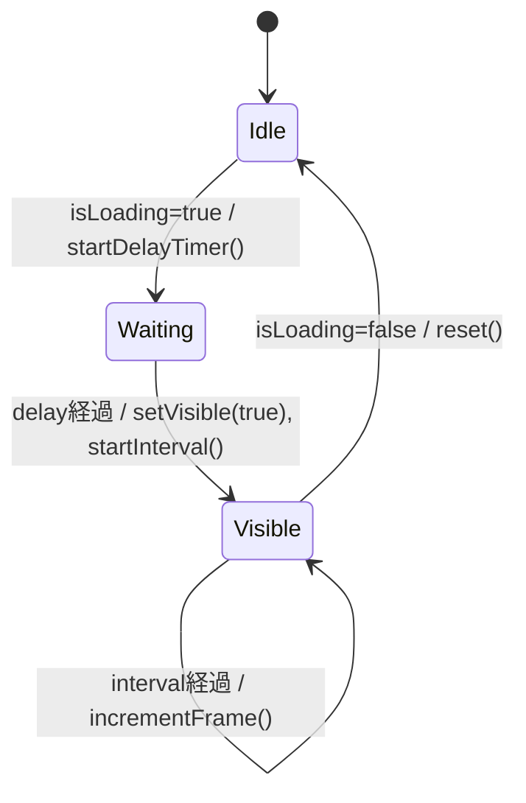

# データモデル: LoadingIndicator タイマー挙動

**仕様ID**: `SPEC-78e66d9a`  
**作成日**: 2025-11-05

## 1. コンポーネント状態

### 状態変数

| 変数名        | 型        | 説明                                   |
|---------------|-----------|----------------------------------------|
| `visible`     | boolean   | スピナー描画の有無                     |
| `frameIndex`  | number    | `safeFrames` の現在位置 (0-based)      |
| `safeFrames`  | string[]  | 表示に使用するフレーム配列 (>=1 要素)  |
| `delayTimerRef` | `Timeout | null` | 表示遅延用タイマー参照          |
| `intervalRef` | `Interval | null` | スピナー更新タイマー参照        |

## 2. タイマーライフサイクル

| イベント                 | アクション                                                         |
|--------------------------|--------------------------------------------------------------------|
| `isLoading` true         | `delayTimerRef = setTimeout(..., delay)`                           |
| delayタイムアウト        | `setVisible(true)` → `startInterval()`                             |
| intervalタイムアウト     | `setFrameIndex((i+1) % safeFrames.length)`                         |
| `isLoading` false        | `clearTimeout(delayTimerRef)` & `clearInterval(intervalRef)`       |
| コンポーネントアンマウント | `useEffect` cleanup で両タイマーをクリア                          |

## 3. テスト検証シナリオ

| シナリオID | 条件                                      | 期待結果                                          |
|------------|-------------------------------------------|---------------------------------------------------|
| TC-01      | `delay=0`, `interval=5`, フレーム3個      | 3 ステップでフレームが `0→1→2` と巡回する        |
| TC-02      | `isLoading` false に更新                  | レンダリングが停止し DOM が空になる              |
| TC-03      | フレーム配列が 1 要素 (`['.']`)          | フレームは常に '.' だが interval がクリアされる  |
| TC-04      | `delay>0`                                 | delay 経過前はレンダリングされず、経過後に表示   |

## 4. インターフェース

`LoadingIndicatorProps` (既存)

| プロパティ | 型        | デフォルト | 説明                         |
|------------|-----------|------------|------------------------------|
| `isLoading`| boolean   | -          | ローディング状態フラグ       |
| `delay`    | number    | 300        | 表示前に待機するミリ秒       |
| `message`  | string    | "Loading..." | 表示メッセージ             |
| `interval` | number    | 80         | フレーム更新間隔             |
| `frames`   | string[]  | `['|','/','-','\\']` | 使用するフレーム群 |

## 5. テスト補助ユーティリティ

- `advanceTimers(delay)` ヘルパー関数をテストに追加し、`act` と組み合わせて疑似タイマーを進める。
- DOM 取得は `data-testid` (`loading-indicator-frame`, `loading-indicator-message`) を利用する。
