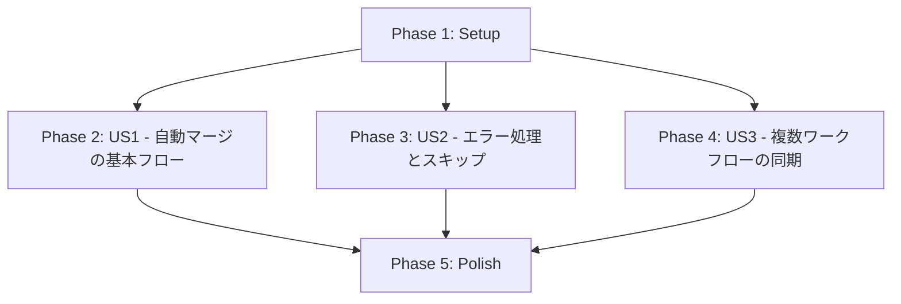

# 実装タスク: PR自動マージ機能

**仕様ID**: `SPEC-cff08403` | **日付**: 2025-10-25 | **参照**: [spec.md](./spec.md), [plan.md](./plan.md)

## 概要

このドキュメントは、PR自動マージ機能を実装するための実行可能なタスクリストです。各ユーザーストーリーごとに独立して実装・テスト・デプロイ可能な形で構成されています。

## タスクサマリー

- **総タスク数**: 16
- **Phase 1 (Setup)**: 1タスク
- **Phase 2 (US1 - 自動マージの基本フロー)**: 6タスク
- **Phase 3 (US2 - エラー処理とスキップ)**: 5タスク
- **Phase 4 (US3 - 複数ワークフローの同期)**: 2タスク
- **Phase 5 (Polish)**: 2タスク

## MVPスコープ

**推奨MVP**: User Story 1（自動マージの基本フロー）

US1を完了すると、CIが成功したPRを自動的にマージする基本機能が動作し、すぐに価値を提供できます。

## 依存関係グラフ

**ストーリー間の依存関係**:
- US1、US2、US3は互いに独立しており、並行実装可能
- すべてのストーリーはSetupフェーズ完了後に開始可能
- Polishフェーズはすべてのストーリー完了後に実施

## 並列実行の機会

### Phase 1: Setup
- すべてのタスクは順次実行

### Phase 2: US1 - 自動マージの基本フロー
- T002とT003は並列実行可能（異なるステップ）
- T004、T005、T006は順次実行

### Phase 3: US2 - エラー処理とスキップ
- T007、T008、T009は並列実行可能（異なるチェックロジック）
- T010、T011は順次実行

### Phase 4: US3 - 複数ワークフローの同期
- T012とT013は順次実行

### Phase 5: Polish
- T014とT015は並列実行可能

---

## Phase 1: Setup（プロジェクト初期化）

**目的**: ワークフローファイルの基本構造を作成

**独立したテスト基準**: N/A（セットアップフェーズ）

### タスク

- [x] T001 .github/workflows/auto-merge.ymlファイルを作成し、基本的なワークフロー構造を定義（name、on、jobs）

---

## Phase 2: User Story 1 - 自動マージの基本フロー (P1)

**ストーリーゴール**: CIが成功したPRを自動的にMerge commitでマージする

**独立したテスト基準**:
1. テストPRを作成し、すべてのCIが成功した後、PRが自動的にマージされることを確認
2. マージ後、PRのコミットがベースブランチに反映されていることを確認
3. マージ方法がMerge commitであることを確認

### タスク

- [x] T002 [P] [US1] workflow_runトリガーを設定し、TestとLintワークフローの完了を検知する in .github/workflows/auto-merge.yml
- [x] T003 [P] [US1] ジョブの実行条件を設定（conclusion=success、event=pull_request）し、必要な権限を定義 in .github/workflows/auto-merge.yml
- [x] T004 [US1] PR番号取得ステップを実装（workflow_run.head_branchからgh pr listで取得）in .github/workflows/auto-merge.yml
- [x] T005 [US1] マージ可能性チェックステップを実装（mergeable、mergeStateStatusを確認）in .github/workflows/auto-merge.yml
- [x] T006 [US1] PRマージステップを実装（gh pr merge --merge --autoを使用）in .github/workflows/auto-merge.yml
- [ ] T007 [US1] 統合テスト: テストPRを作成し、CI成功後に自動マージされることを確認

---

## Phase 3: User Story 2 - エラー処理とスキップ (P1)

**ストーリーゴール**: CI失敗や競合がある場合、安全に自動マージをスキップする

**独立したテスト基準**:
1. CI失敗時に自動マージがスキップされ、適切なログが記録されることを確認
2. マージ競合があるPRで自動マージがスキップされることを確認
3. ドラフトPRが自動マージの対象外となることを確認
4. スキップ理由がワークフローログに明確に記録されることを確認

### タスク

- [x] T008 [P] [US2] CI失敗検知ロジックを追加（workflow_run.conclusion != 'success'時の処理）in .github/workflows/auto-merge.yml
- [x] T009 [P] [US2] 競合検知ロジックを追加（mergeable != 'MERGEABLE'時のスキップ処理）in .github/workflows/auto-merge.yml
- [x] T010 [P] [US2] ドラフトPR除外ロジックを追加（isDraft=trueの確認）in .github/workflows/auto-merge.yml
- [x] T011 [US2] エラーログとスキップログの記録機能を実装（echoでスキップ理由を出力）in .github/workflows/auto-merge.yml
- [ ] T012 [US2] 統合テスト: CI失敗、競合、ドラフトPRの各シナリオでスキップを確認

---

## Phase 4: User Story 3 - 複数ワークフローの同期 (P2)

**ストーリーゴール**: 複数のCIワークフロー（Test、Lint）がすべて完了してからマージする

**独立したテスト基準**:
1. 複数のワークフローが並行実行される場合、すべてが成功するまで待機することを確認
2. 一つのワークフローが失敗した場合、他のワークフローの結果に関係なくマージがスキップされることを確認
3. mergeStateStatusが全ワークフローの状態を正しく反映していることを確認

### タスク

- [x] T013 [US3] workflow_runトリガーのworkflows配列にTestとLintの両方を設定し、両方を監視 in .github/workflows/auto-merge.yml
- [ ] T014 [US3] 統合テスト: 複数ワークフローが順次完了する場合、最後のワークフロー完了時にマージを確認

---

## Phase 5: Polish & Cross-Cutting Concerns

**目的**: ドキュメント整備と最終検証

### タスク

- [x] T015 [P] README.mdに自動マージ機能の説明を追加（機能概要、動作条件、無効化方法）
- [x] T016 [P] quickstart.mdのセットアップ手順を最終確認し、実際の手順と一致していることを検証

---

## 実装戦略

### 推奨実装順序

1. **MVP (Phase 1 + Phase 2)**: 自動マージの基本フロー
   - Setup → US1の実装
   - テストPRで動作確認
   - デプロイ可能な最小限の機能

2. **安全機能追加 (Phase 3)**: エラー処理とスキップ
   - US2の実装
   - 各種エラーケースのテスト
   - 本番環境での安全性確保

3. **複数ワークフロー対応 (Phase 4)**: 複数ワークフローの同期
   - US3の実装
   - 実環境での完全な動作確認

4. **仕上げ (Phase 5)**: ドキュメント整備
   - README更新
   - ドキュメント検証

### 並列実装の推奨事項

- **US1とUS2**: 異なる開発者が並行実装可能（US1が基本実装、US2がエラーハンドリング追加）
- **US3**: US1完了後に実装（基本構造への追加）

### テスト戦略

すべてのユーザーストーリーは実際のPRを使用した統合テストで検証します：

1. **テストブランチの作成**: `test/auto-merge-*`パターン
2. **PRの作成**: GitHub CLIまたはUI
3. **シナリオ実行**: 各ストーリーの受け入れ基準に従ってテスト
4. **ログ確認**: GitHub Actionsのワークフローログで詳細を検証
5. **クリーンアップ**: テストブランチとPRの削除

### 品質チェックポイント

各フェーズ完了時に以下を確認：

- [ ] ワークフローファイルの構文が正しい（GitHub Actions UIで確認）
- [ ] すべてのステップが適切なエラーハンドリングを持つ
- [ ] ログ出力が明確で、トラブルシューティングに役立つ
- [ ] セキュリティベストプラクティスに従っている（最小権限、機密情報の非表示）

---

## 参考資料

- [spec.md](./spec.md): 機能仕様
- [plan.md](./plan.md): 実装計画
- [data-model.md](./data-model.md): データモデル
- [research.md](./research.md): 技術調査
- [contracts/](./contracts/): API契約
- [quickstart.md](./quickstart.md): クイックスタートガイド

---

## 進捗管理

### 完了基準

各タスクは以下の基準を満たした時点で完了とします：

1. コードが実装されている
2. ワークフローファイルが構文エラーなく動作する
3. 該当するテストシナリオが成功している
4. コミットメッセージが明確である

### 次のステップ

タスク生成完了後、`/speckit.implement`コマンドで実装を開始します。
